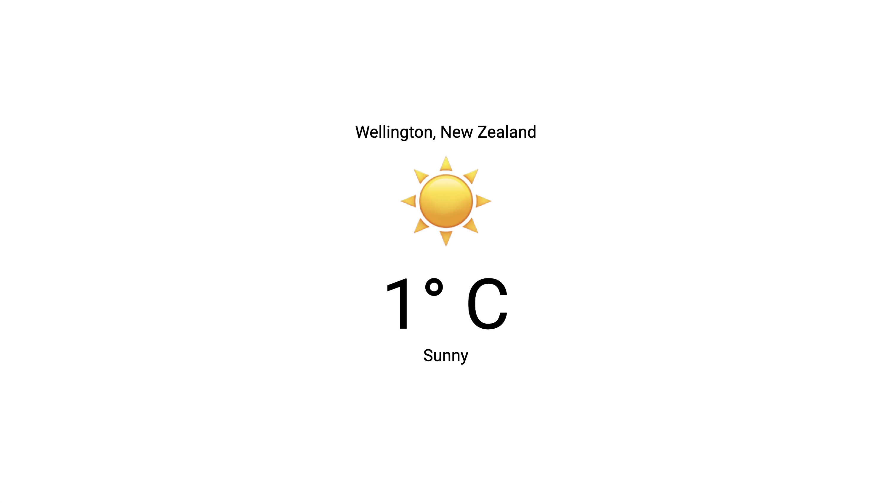

# Weather UI

React-based weather application displaying current weather information with clean, minimalist design. Fetches data from a configurable CGI API endpoint and displays it with emoji-based weather icons.

## Screenshot



*Weather UI showing live weather data for Wellington, New Zealand with emoji-based weather icons and clean typography.*

## About the Project

### What This Is
Weather UI application that fetches data from local CGI API and displays it in a clean, mobile-first interface matching the design mockup for Wellington, New Zealand.

### Architecture
- **Frontend**: React with Tailwind CSS and DaisyUI components
- **Data Layer**: Abstraction service for API integration (future-proof for API changes)
- **API**: Local CGI endpoint at configurable base URL
- **Icons**: Emoji-based weather representations
- **Responsive**: Mobile-first design with desktop optimization

### Technical Stack
- React 19.1.1 (frontend framework)
- Vite 7.1.7 (build tool and dev server)
- Tailwind CSS 4.1.17 (styling)
- DaisyUI 5.4.7 (component library)
- Native fetch API (HTTP client)
- Emoji icons (weather visualization)

## Configuration

### Environment Variables

The application uses environment variables for configuration. Create a `.env` file in the project root:

```bash
# Development (empty for Vite proxy)
VITE_API_BASE_URL=

# Production (full URL to your weather API)
VITE_API_BASE_URL=http://your-server.com:8000
```

### Development Setup

1. **Install dependencies**:
   ```bash
   npm install
   ```

2. **Configure API endpoint**:
   - For development: Leave `VITE_API_BASE_URL` empty (uses Vite proxy)
   - Ensure your CGI server runs on `localhost:8000`

3. **Start development server**:
   ```bash
   npm run dev
   ```
   - App runs on `http://localhost:5173`
   - Vite proxy forwards `/cgi-bin/*` to `localhost:8000`

### Production Setup

1. **Configure production API**:
   ```bash
   # .env
   VITE_API_BASE_URL=http://your-production-server.com:8000
   ```

2. **Build for production**:
   ```bash
   npm run build
   ```

3. **Preview production build**:
   ```bash
   npm run preview
   ```

## API Requirements

The application expects a CGI endpoint that:
- **URL**: `{BASE_URL}/cgi-bin/weather.cgi?city={cityName}`
- **Method**: GET
- **Response**: XML format with weather data
- **Example Response**:
  ```xml
  <?xml version="1.0"?>
  <weather>
    <location>Wellington, New Zealand</location>
    <temperature>14.2</temperature>
    <unit>Celsius</unit>
    <description>thunderstorm</description>
    <code>110</code>
  </weather>
  ```

## Troubleshooting

### Common Issues

**"Unable to connect to weather service"**
- Check if your CGI server is running on the configured port
- Verify `VITE_API_BASE_URL` is set correctly
- In development, ensure server runs on `localhost:8000`

**"Weather service is taking too long to respond"**
- API calls timeout after 5 seconds
- Check server performance and network connectivity
- Restart your CGI server if it's unresponsive

**"CORS errors in browser console"**
- In development: Vite proxy should handle CORS automatically
- In production: Configure your server to allow cross-origin requests
- Check that `VITE_API_BASE_URL` matches your server configuration

**"Weather data format is invalid"**
- Verify your CGI server returns valid XML format
- Check server logs for errors in weather data generation
- Ensure all required XML fields are present (location, temperature, description)

### Development Commands

```bash
# Start development server
npm run dev

# Build for production
npm run build

# Preview production build
npm run preview

# Run linting
npm run lint
```

## Project Structure

```
weather-ui/
├── src/
│   ├── api/           # Weather API service and data normalization
│   ├── hooks/         # Custom React hooks (useWeather)
│   ├── components/    # React components
│   └── main.jsx       # Application entry point
├── dev_log/           # MMDD development documentation
├── design/            # UI mockups and design assets
├── .env               # Environment configuration
└── README.md          # This file
```

## Development Methodology

This project follows **Micromanaged Driven Development (MMDD)** with systematic documentation in the `dev_log/` directory. Each development phase is captured as units and subunits for AI-assisted development tracking.
